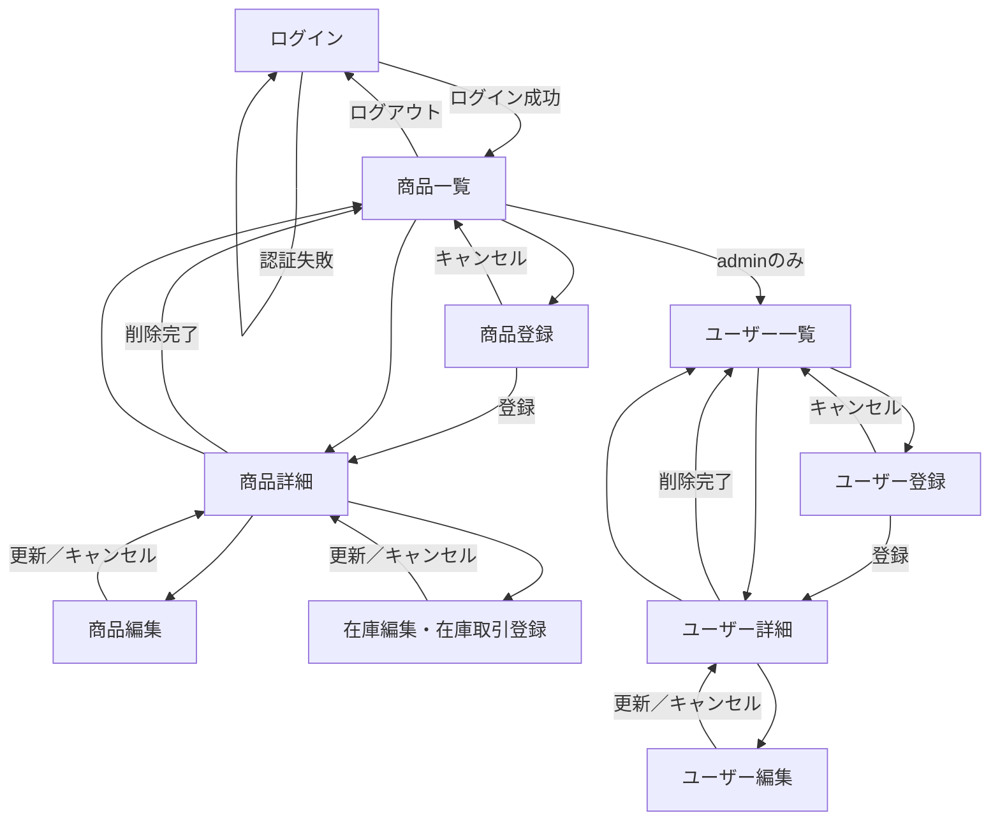

# 商品在庫管理CRUD 画面遷移図・画面レイアウト

このドキュメントは、各技術構成で共通して実装する画面の遷移と、主要画面の基本レイアウトを示す。実際の配色やコンポーネントの細部は各構成に合わせてよいが、画面間の導線と表示する情報は共通仕様に従う。

## 1. 画面遷移図



### 遷移時の共通ルール

- 未ログインの状態で管理画面へアクセスした場合は、ログイン画面へ遷移する。
- ログイン成功後の初期表示は商品一覧とする。
- ヘッダーから商品一覧へ移動できる。`admin` の場合のみユーザー一覧への導線も表示する。
- `staff` は商品の閲覧と入出庫登録、`viewer` は閲覧のみとする。現在在庫数の補正は `admin` のみとし、権限のない操作への導線は表示しない。
- 登録・更新後は対象の詳細画面、削除後は対象の一覧画面へ遷移する。
- 削除操作では確認ダイアログを表示し、キャンセルした場合は現在の画面に留まる。

## 2. 共通レイアウト

ログイン後の画面は、共通ヘッダーとメインコンテンツで構成する。狭い画面ではナビゲーションと操作ボタンを折り返し、表は横スクロールできるようにする。

```text
┌────────────────────────────────────────────────────────────────────┐
│ 商品在庫管理     [商品一覧] [ユーザー管理※admin]  ロール／名前 [ログアウト] │
├────────────────────────────────────────────────────────────────────┤
│ パンくずリスト                                                     │
│                                                                    │
│ ページタイトル                                      主要操作ボタン │
│ ────────────────────────────────────────────────────────────────── │
│                                                                    │
│                         メインコンテンツ                           │
│                                                                    │
└────────────────────────────────────────────────────────────────────┘
```

## 3. 主要画面レイアウト

### 3.1 ログイン

```text
┌──────────────────────────────────────────┐
│              商品在庫管理                │
│                                          │
│  ┌────────────────────────────────────┐  │
│  │ ログイン                           │  │
│  │                                    │  │
│  │ メールアドレス                     │  │
│  │ [                                  ] │  │
│  │ パスワード                         │  │
│  │ [                                  ] │  │
│  │ ! 認証エラーメッセージ（失敗時）   │  │
│  │                         [ログイン]  │  │
│  └────────────────────────────────────┘  │
└──────────────────────────────────────────┘
```

### 3.2 商品一覧

```text
┌──────────────────────────────────────────────────────────────────────────┐
│ 商品一覧                                                    [新規登録]※ │
│                                                                          │
│ [SKU・商品名・説明を検索          ] [ステータス▼] [カテゴリ▼]           │
│ [在庫不足のみ□] [並び順▼] [検索] [条件をクリア]                         │
│                                                                          │
│ ┌──────┬────────┬──────┬────┬────┬────────┬──────┬────────┬──────┐ │
│ │ SKU  │ 商品名 │カテゴリ│価格│在庫│安全在庫│状態  │在庫更新│操作  │ │
│ ├──────┼────────┼──────┼────┼────┼────────┼──────┼────────┼──────┤ │
│ │A-001 │ 商品A  │食品  │¥500│  3!│      5 │販売中│日時    │詳細… │ │
│ └──────┴────────┴──────┴────┴────┴────────┴──────┴────────┴──────┘ │
│ ! 在庫数が安全在庫数以下の行・在庫数は警告色で表示                       │
│                         [前へ]  1 / 10  [次へ]                           │
└──────────────────────────────────────────────────────────────────────────┘
※ 新規登録・編集・削除・在庫操作は、ロールに応じて表示する。
```

カテゴリ選択は `category`、在庫不足のみのチェックは `low_stock=true` の絞り込みに対応する。データがない場合は表の代わりに空状態メッセージを表示し、登録権限があるユーザーには新規登録への導線を併記する。

### 3.3 商品詳細

```text
┌──────────────────────────────────────────────────────────────────┐
│ 商品詳細               [一覧へ] [編集]※ [在庫操作]※ [削除]※    │
│                                                                  │
│ ┌ 商品情報 ────────────────────────────────────────────────────┐ │
│ │ SKU / 商品名 / 説明 / カテゴリ / 価格 / ステータス          │ │
│ │ 作成日時 / 更新日時                                          │ │
│ └──────────────────────────────────────────────────────────────┘ │
│ ┌ 在庫情報 ────────────────────────────────────────────────────┐ │
│ │ 現在在庫数 / 安全在庫数 / 在庫更新日時                       │ │
│ └──────────────────────────────────────────────────────────────┘ │
│ ┌ 直近の在庫取引 ──────────────────────────────────────────────┐ │
│ │ 日時 │ 種別 │ 増減数 │ 取引後在庫 │ 理由 │ 操作者           │ │
│ └──────────────────────────────────────────────────────────────┘ │
└──────────────────────────────────────────────────────────────────┘
※ ロールに応じて表示する。
```

### 3.4 商品登録・編集

```text
┌──────────────────────────────────────────────────────────┐
│ 商品登録（または商品編集）                               │
│                                                          │
│ SKU *                 [                                ]  │
│ 商品名 *              [                                ]  │
│ 説明                   [                                ]  │
│                        [                                ]  │
│ カテゴリ               [                                ]  │
│ 価格（円）*            [                                ]  │
│ ステータス *           [販売中                       ▼]  │
│ 初期在庫数 *           [                                ]  │
│ 安全在庫数 *           [                                ]  │
│                                                          │
│ ! 各入力エラーは該当項目の直下に表示                    │
│                                  [キャンセル] [登録／更新]│
└──────────────────────────────────────────────────────────┘
```

編集時は既存値を初期表示する。初期在庫数は商品登録時だけ表示し、登録後の在庫数変更は在庫操作画面で行う。

### 3.5 在庫編集・在庫取引登録

```text
┌────────────────────────────────────────────────────────────────┐
│ 在庫操作: A-001 商品A                                         │
│                                                                │
│ ┌ 在庫設定を更新 ────────────────────────────────────────────┐ │
│ │ 安全在庫数 *                  [ 5                        ]  │ │
│ │ ! 0以上の整数を入力                                      │ │
│ │                                          [設定を更新]     │ │
│ └────────────────────────────────────────────────────────────┘ │
│                                                                │
│ ┌ 在庫取引を登録 ────────────────────────────────────────────┐ │
│ │ 現在在庫数（更新前）          10                           │ │
│ │ 取引種別 *                    [入庫／出庫               ▼]  │ │
│ │ 数量 *                        [                         ]  │ │
│ │ 取引後在庫（プレビュー）       15                           │ │
│ │ 理由・メモ                    [                         ]  │ │
│ │ ! 出庫後の在庫が0未満になる場合などのエラーを表示        │ │
│ │                                         [取引を登録]       │ │
│ └────────────────────────────────────────────────────────────┘ │
│                                                                │
│ ┌ 実在庫数に補正（adminのみ）────────────────────────────────┐ │
│ │ 現在在庫数（補正前）          10                           │ │
│ │ 補正後在庫数 *                [ 7                        ]  │ │
│ │ 調整差分                      -3                           │ │
│ │ 補正理由 *                    [棚卸しによる差異          ]  │ │
│ │                                         [在庫数を補正]     │ │
│ └────────────────────────────────────────────────────────────┘ │
│                                                [キャンセル]    │
└────────────────────────────────────────────────────────────────┘
```

「設定を更新」は安全在庫数だけを更新し、在庫取引は作成しない。「取引を登録」は staff と admin が利用でき、入庫または出庫の増減量を指定して、現在在庫数の更新と在庫取引履歴の作成を同時に行う。一般ユーザーが現在在庫数を直接指定する操作は提供しない。

「実在庫数に補正」は admin のみが利用できる。admin は補正後在庫数と必須の補正理由を指定し、システムは現在在庫数との差分を `adjustment` の在庫取引履歴として記録してから現在在庫数を更新する。補正開始後に別の取引で在庫数が変化していた場合は保存せず、最新情報の再取得を求める。すべての操作後に最新の現在在庫数を画面へ反映する。

### 3.6 ユーザー一覧・詳細・フォーム（adminのみ）

```text
┌──────────────────────────────────────────────────────────────────┐
│ ユーザー一覧                                          [新規登録] │
│ [メールアドレス・表示名を検索    ] [ロール▼] [検索]              │
│ ┌──────────────┬────────┬────────┬────────┬────────┬──────┐ │
│ │メールアドレス│表示名  │ロール  │作成日時│更新日時│操作  │ │
│ └──────────────┴────────┴────────┴────────┴────────┴──────┘ │
└──────────────────────────────────────────────────────────────────┘

┌──────────────────────────────────────────────────────────┐
│ ユーザー詳細                  [一覧へ] [編集] [削除]      │
│ メールアドレス / 表示名 / ロール / 作成日時 / 更新日時  │
└──────────────────────────────────────────────────────────┘

┌──────────────────────────────────────────────────────────┐
│ ユーザー登録（またはユーザー編集）                       │
│ メールアドレス *        [                              ]  │
│ 表示名 *                [                              ]  │
│ ロール *                [staff                      ▼]  │
│ パスワード *            [                              ]  │
│                         [キャンセル] [登録／更新]         │
└──────────────────────────────────────────────────────────┘
```

編集時のパスワードは任意入力とし、入力された場合だけ更新する。自分自身または最後の `admin` に対する禁止操作では、操作ボタンを無効化または非表示にし、理由を表示する。

## 4. フィードバック表示

- 入力エラーは対象項目の近くに表示し、送信後も入力値を保持する。
- APIや通信に起因する画面全体のエラーは、ページタイトルの下に表示する。
- 登録・更新・削除に成功した場合は、遷移先で完了メッセージを表示する。
- データ取得中はローディング表示を出し、二重送信を防ぐため送信中のボタンを無効化する。
- 取得対象が存在しない場合は「見つかりません」画面を表示し、一覧へ戻る導線を用意する。
